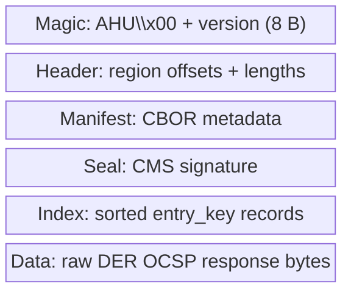
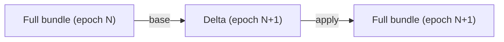
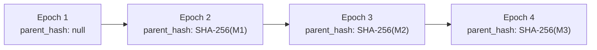

# ahu Bundle Format

An **ahu** bundle is a self-describing container that packages pre-signed
OCSP responses for efficient, zero-copy serving. The name follows Hawaiian
convention -- *ahu* means "a heap, a pile, a collection."

## Container layout

Every ahu bundle follows a fixed layout with five regions:

```
+========================+
|     Magic (8 bytes)    |  "AHU\x00" + version u32
+------------------------+
|    Header (variable)   |  Lengths and offsets for all regions
+------------------------+
|  Manifest (CBOR blob)  |  Structured metadata about the bundle
+------------------------+
|   Seal (CMS / raw)     |  Cryptographic binding over manifest + index + data
+------------------------+
|   Index (sorted keys)  |  entry_key -> (offset, length) into data region
+------------------------+
|   Data (DER responses) |  Raw OCSP response bytes, directly servable
+========================+
```



### Magic bytes

The first 8 bytes identify the file format and version:

| Offset | Length | Contents |
|--------|--------|----------|
| 0 | 4 | `AHU\x00` (ASCII + null) |
| 4 | 4 | Version number (little-endian u32, currently `1`) |

### Header

The header records the byte offset and length of every subsequent region.
It is fixed-size for a given format version, making it possible to seek
directly to any region without parsing the entire file.

### Manifest (CBOR)

The manifest is a CBOR map containing structured metadata:

| Field | CBOR type | Description |
|-------|-----------|-------------|
| `producer` | text string | Identifier of the signing software (e.g., `"hoike-sign/0.1.0"`) |
| `epoch` | unsigned int | Monotonically increasing generation number |
| `scope` | text string | CA label identifying which issuer this bundle covers |
| `algorithm` | text string | Signature algorithm used for OCSP responses (e.g., `"ecdsa-p256"`, `"ml-dsa-65"`) |
| `entry_count` | unsigned int | Number of entries in the index |
| `created_at` | text string | ISO 8601 creation timestamp |
| `parent_hash` | byte string | SHA-256 of the previous generation's manifest (null for epoch 1) |
| `base_epoch` | unsigned int | For delta bundles: the epoch this delta applies against |
| `validity_start` | text string | `thisUpdate` for the batch (ISO 8601) |
| `validity_end` | text string | `nextUpdate` for the batch (ISO 8601) |

### Seal (CMS)

The seal is a CMS (RFC 5652) `SignedData` structure that covers the
concatenation of the manifest, index, and data regions. It binds the
entire bundle content to the signer's identity.

For verification, the `ahu verify` command checks:

1. The CMS signature is valid against the embedded signer certificate
2. The signer certificate chains to a trusted CA
3. The signed content matches the SHA-256 digest of (manifest || index || data)

### Index

The index is a sorted array of fixed-size records, one per OCSP response
entry:

| Field | Size | Description |
|-------|------|-------------|
| `entry_key` | 32 bytes | SHA-256 of the DER-encoded CertID |
| `data_offset` | 8 bytes | Byte offset into the data region (little-endian u64) |
| `data_length` | 4 bytes | Length of the response in the data region (little-endian u32) |

**Total record size: 44 bytes.**

The index is sorted by `entry_key` in lexicographic order, enabling
**O(log n) binary search** on the memory-mapped file. For a bundle with
10 million entries, a lookup requires at most 24 comparisons (ceil(log2(10^7))).

### Data region

The data region contains raw DER-encoded OCSP responses packed
contiguously. Each response is a complete `OCSPResponse` (RFC 6960) that
can be written directly to the HTTP response body with no transformation.

This is the key to hoike's serving performance: the edge process memory-maps
the bundle, binary-searches the index for the entry key, and writes the
data region slice directly to the socket. No deserialization, no re-encoding,
no allocation.

## Delta bundles

A delta bundle contains only the entries that changed since a base epoch.
The manifest includes a `base_epoch` field identifying which full bundle
the delta applies against.

### Delta structure



A delta bundle uses the same container format but with two differences:

1. The manifest includes `base_epoch` pointing to the full bundle
2. The index contains only changed entries (additions, updates, removals)

Removal entries use a sentinel `data_length` of `0` to indicate that the
entry should be deleted when applying the delta.

### Loading rules

When an edge node receives a new generation:

1. If the bundle is a full bundle, replace the current working set
2. If the bundle is a delta, verify that `base_epoch` matches the
   currently loaded epoch, then merge:
   - Add new entries
   - Replace updated entries
   - Remove entries with zero-length data
3. Reject any bundle with an epoch not strictly greater than the current
   epoch (anti-rollback)

## Anti-rollback epoch chain

Each generation's manifest contains a `parent_hash` -- the SHA-256 of the
previous generation's manifest bytes. This creates a hash chain:



An edge node that has verified epoch N can verify that epoch N+1 is a
legitimate successor by checking:

1. `epoch(N+1) > epoch(N)` -- monotonic advance
2. `parent_hash(N+1) == SHA-256(manifest(N))` -- chain continuity
3. The seal on epoch N+1 is valid

This prevents an attacker from substituting an older bundle (rollback) or
a bundle from a different signer lineage (fork).

## Memory mapping and zero-copy serving

The ahu format is designed for `mmap(2)`:

```
                   Process virtual memory
                   +======================+
                   |      ahu file         |
    mmap'd region  |  +-----------------+  |
                   |  | magic + header  |  |  (parsed once at load)
                   |  +-----------------+  |
                   |  | manifest (CBOR) |  |  (parsed once at load)
                   |  +-----------------+  |
                   |  | seal            |  |  (verified once at load)
                   |  +-----------------+  |
                   |  | index           |  |  <-- binary search target
                   |  +-----------------+  |
                   |  | data            |  |  <-- response bytes served directly
                   |  +-----------------+  |
                   +======================+
```

At load time, the edge verifies the seal and parses the manifest. At
request time, only the index is searched and data bytes are written -- both
operations touch memory pages that the OS manages via its page cache. No
heap allocation is required in the hot path.

## File sizes

Bundle size scales linearly with entry count and response size:

| Entries | Avg response size | Index size | Data size | Total |
|---------|-------------------|------------|-----------|-------|
| 1,000 | 500 B | 43 KB | 488 KB | ~550 KB |
| 100,000 | 500 B | 4.2 MB | 47.7 MB | ~52 MB |
| 1,000,000 | 500 B | 42 MB | 477 MB | ~520 MB |
| 10,000,000 | 500 B | 420 MB | 4.7 GB | ~5.1 GB |

For post-quantum signatures (ML-DSA-87), response sizes are roughly 10x
larger. See the [Post-Quantum Readiness](../compliance/pqc.md) page for
detailed sizing.
