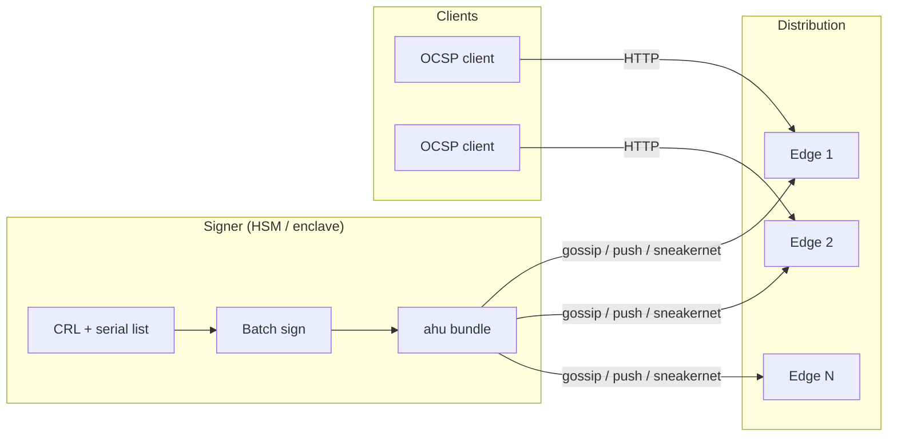
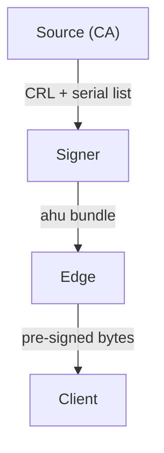
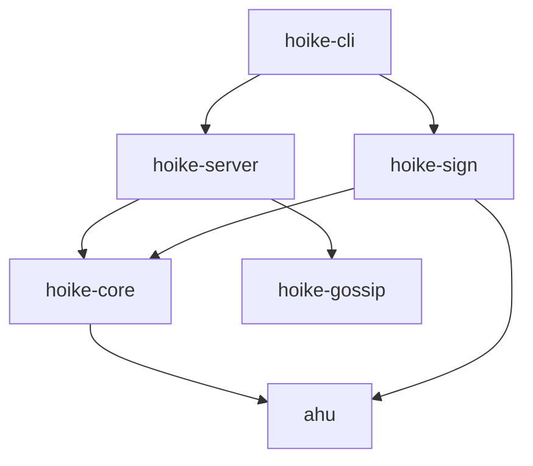

# Architecture Overview

hoike is built around a single architectural bet: **separate signing from
serving**. The OCSP signing key never touches a machine that handles client
traffic. An edge node compromise cannot produce a false "good" response
because edge nodes have no signing material -- they serve only pre-signed
bytes delivered through a verified bundle chain.

## The signer/edge split

Traditional OCSP responders combine signing and serving in one process.
Every node that handles client requests holds the signing key, which makes
each node a high-value target. hoike eliminates this by splitting the work
into two roles:



| Concern | Signer | Edge |
|---------|--------|------|
| Signing key access | Yes (HSM or file) | Never |
| Client traffic | Never | Yes |
| Network exposure | Minimal or air-gapped | Internet-facing |
| Cryptographic work at request time | N/A | Zero |
| Scaling model | Single or active-passive pair | Horizontal, stateless |

## Trust boundary

The fundamental invariant:

> **An edge node compromise must not produce a false "good" response.**

Edge nodes are keyless replay engines. They memory-map a verified ahu
bundle and return pre-signed bytes verbatim. Without the signing key, a
compromised edge can only:

- Serve stale responses (mitigated by anti-rollback epoch checks)
- Refuse to serve (denial of service, not a trust violation)
- Serve the wrong response for a serial (mitigated by the sealed index)

It **cannot** forge a "good" response for a revoked certificate.

## Three operating modes

hoike runs as a single binary (`hoike`) in one of three modes:

### Signer mode

The signer reads CA material (issuer certificate, signing key, CRLs, good
serial lists), batch-produces pre-signed OCSP responses, and packages them
into ahu bundles. It can optionally push bundles to edge nodes via gossip.

```sh
hoike sign \
  --ca my-issuing-ca \
  --issuer-cert ca.crt \
  --signer-cert ocsp.crt \
  --signer-key ocsp.key \
  --crl ca.crl \
  --good-serials serials.txt \
  --sig-alg ecdsa-p256 \
  --epoch 42 \
  --output my-ca.ahu
```

The signer is the only component that touches private keys.

### Edge mode

The edge serves HTTP OCSP responses from one or more loaded ahu bundles.
It performs no cryptographic operations at request time -- responses are
returned as raw bytes from memory-mapped bundle files.

```sh
hoike serve \
  --config /etc/hoike/hoike.toml \
  --bundle-dir /var/lib/hoike/bundles
```

### Combined mode

For smaller deployments, hoike can run signing and serving in a single
process. The trust boundary still exists logically: signing happens on a
timer (batch interval) and the edge path reads from the resulting bundle.

This mode is convenient for development and single-machine deployments but
sacrifices the physical isolation that makes the signer/edge split
valuable.

## Tier responsibilities

Each tier manages distinct state:

| Tier | Stateful components | Persistence |
|------|---------------------|-------------|
| **Source** (CA) | Certificate database, CRLs, revocation records | Authoritative -- hoike reads but does not modify |
| **Signer** | Batch position, current epoch, HSM session, signing key | Durable -- epoch must advance monotonically |
| **Edge** | Loaded working set (mmap'd bundles), epoch marks per CA | Ephemeral -- reconstructible from latest bundle |

### State flow



State flows strictly downward. The edge never writes back to the signer,
and the signer never writes back to the source CA.

## Workspace crate map

hoike is a Cargo workspace with six crates. The dependency graph enforces
architectural boundaries:



| Crate | Purpose | License | Key deps |
|-------|---------|---------|----------|
| `ahu` | Bundle format read/write/verify | Apache-2.0 OR MIT | der, ciborium, memmap2, zstd |
| `hoike-core` | CertID routing, request parsing, config, state | GPL-3.0+ | ahu, x509-ocsp, der |
| `hoike-sign` | Response production, CRL parsing, batch signing | GPL-3.0+ | ahu, hoike-core, ml-dsa |
| `hoike-server` | axum HTTP handlers, RFC 9919 headers | GPL-3.0+ | hoike-core, axum, tokio |
| `hoike-gossip` | SWIM membership + generation announcements | GPL-3.0+ | foca |
| `hoike-cli` | Binary entry points for `hoike` and `ahu` | GPL-3.0+ | all above |

The `ahu` crate is dual-licensed so that other projects can consume the
bundle format without GPL obligations. It must never depend on tokio, hyper,
axum, or PKCS#11 -- it is a pure data-format library.
