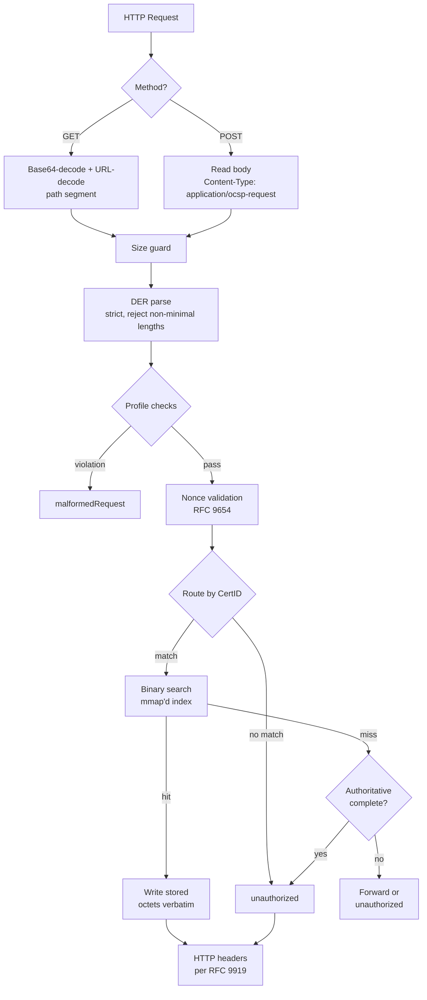
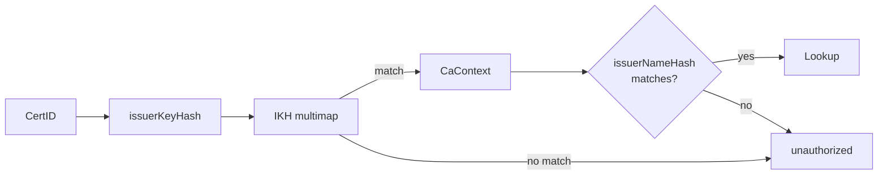

# Request Path

This page traces an OCSP request from HTTP arrival to response delivery.
Every step on this path is designed for minimal latency: no heap allocation,
no cryptographic work, no database queries. The edge serves pre-signed
bytes from memory-mapped files.

## Overview



## HTTP method handling

hoike accepts OCSP requests via both GET and POST, as required by RFC 6960
Section 3 and profiled by RFC 9919 Section 6.

### GET requests

The OCSP request is DER-encoded, then base64-encoded, then URL-encoded in
the path segment:

```
GET /AhwwGjAYMBYwFDASBBB...base64...= HTTP/1.1
```

hoike:

1. Extracts the path segment after the base path
2. URL-decodes the segment
3. Base64-decodes (standard alphabet, with padding) to obtain the DER bytes

### POST requests

The OCSP request is sent as the raw body:

```
POST / HTTP/1.1
Content-Type: application/ocsp-request

<DER bytes>
```

hoike reads the body up to the size limit. The `Content-Type` header must
be `application/ocsp-request`.

## Size guard

Before parsing, hoike enforces a maximum request size (configurable,
default 4 KB). OCSP requests are small -- a single-certificate request
is typically 80-120 bytes. A request exceeding the limit is rejected with
`malformedRequest`.

## DER parsing

hoike uses strict DER parsing via the RustCrypto `der` crate:

- **Non-minimal length encodings are rejected.** DER requires that length
  octets use the smallest possible encoding. A length of 127 encoded in
  long form (0x81 0x7F instead of 0x7F) is rejected.
- **Trailing bytes are rejected.** The DER parser must consume the entire
  input.
- **Tag mismatches are rejected.** The parser validates every ASN.1 tag
  against the expected schema.

This strict parsing is a security boundary: it prevents malformed requests
from reaching the routing or lookup logic.

### Parsed structure

The parsed `OCSPRequest` yields:

```
OCSPRequest ::= SEQUENCE {
    tbsRequest      TBSRequest,
    optionalSignature  [0] EXPLICIT Signature OPTIONAL
}

TBSRequest ::= SEQUENCE {
    version         [0] EXPLICIT Version DEFAULT v1,
    requestorName   [1] EXPLICIT GeneralName OPTIONAL,
    requestList     SEQUENCE OF Request,
    requestExtensions [2] EXPLICIT Extensions OPTIONAL
}

Request ::= SEQUENCE {
    reqCert         CertID,
    singleRequestExtensions [0] EXPLICIT Extensions OPTIONAL
}

CertID ::= SEQUENCE {
    hashAlgorithm   AlgorithmIdentifier,
    issuerNameHash  OCTET STRING,
    issuerKeyHash   OCTET STRING,
    serialNumber    CertificateSerialNumber
}
```

## Profile checks

hoike validates the request against the RFC 9919 Lightweight OCSP Profile:

| Check | Rule | Failure |
|-------|------|---------|
| Version | Must be v1 (default) | malformedRequest |
| Request count | Single CertID per request (RFC 9919 Section 4) | malformedRequest |
| Hash algorithm | SHA-256 preferred; SHA-1 accepted for compatibility | malformedRequest if unsupported |
| Signed request | Signature on request is ignored (RFC 9919 Section 4.1) | N/A |

## Nonce validation

If the request contains a nonce extension, hoike applies the rules from
RFC 9654:

- Nonce length must be between 1 and 32 octets
- Nonces shorter than 1 octet or longer than 32 octets are rejected
- The nonce is not echoed in pre-signed responses (RFC 9919 Section 5:
  nonces are incompatible with pre-production)

The nonce policy is configurable per CA scope. Options:

| Policy | Behavior |
|--------|----------|
| `reject` | Return `malformedRequest` if nonce present |
| `ignore` | Accept the request but do not echo the nonce |
| `warn` | Log a warning and process without nonce |

## CertID routing

The `CertID` from the parsed request is used to route to the appropriate
CA context. Routing uses the **issuerKeyHash** as the primary key, with
**hashAlgorithm** and **issuerNameHash** as validation:



The issuerKeyHash multimap allows a single hoike instance to serve
responses for multiple CAs. Each CA's loaded bundle is associated with
the SHA-256 (and optionally SHA-1) hash of the issuer's Subject Public Key
Info.

## Index lookup

Once a CaContext is selected, hoike looks up the specific certificate in
the ahu bundle's sorted index.

### Entry key computation

The entry key is the SHA-256 hash of the DER-encoded CertID:

```
entry_key = SHA-256(DER(CertID))
```

This hashing step normalizes all CertID variants (SHA-1 vs SHA-256 hash
algorithm) into a uniform 32-byte key.

### Binary search

The index is a sorted array of 44-byte records in the memory-mapped bundle.
hoike performs a standard binary search:

```
Index region (mmap'd):
+--------+--------+--------+--------+--------+
| rec[0] | rec[1] | rec[2] | ...    | rec[N] |
+--------+--------+--------+--------+--------+
  44 B      44 B     44 B             44 B

Each record:
  [entry_key: 32 B] [offset: 8 B] [length: 4 B]
```

For a bundle with N entries, lookup requires at most ceil(log2(N))
comparisons:

| Entries | Max comparisons |
|---------|-----------------|
| 1,000 | 10 |
| 100,000 | 17 |
| 1,000,000 | 20 |
| 10,000,000 | 24 |

### Hit: verbatim byte serving

On a hit, the index record yields an offset and length into the data
region. hoike writes those bytes directly to the HTTP response body:

```rust
// Conceptual hot path (no actual allocation)
let data_slice = &mmap[data_start + offset .. data_start + offset + length];
response_body.write_all(data_slice);
```

No deserialization, no re-encoding, no signing. The bytes in the data
region are a complete, valid `OCSPResponse` DER encoding.

### Miss: unauthorized or forward

If the entry key is not found in the index:

- **Authoritative-complete mode**: The bundle claims to contain responses
  for all certificates issued by this CA. A miss means the serial number
  was never issued, so hoike returns `unauthorized`.
- **Non-authoritative mode**: The bundle may be a partial working set.
  A miss can be forwarded to a fallback responder or returned as
  `unauthorized` (configurable).

## HTTP response headers

hoike sets response headers per RFC 9919 Section 6 and Section 7.2:

```http
HTTP/1.1 200 OK
Content-Type: application/ocsp-response
Last-Modified: Thu, 01 Jan 2026 00:00:00 GMT
Expires: Fri, 02 Jan 2026 00:00:00 GMT
ETag: "a1b2c3d4..."
Cache-Control: max-age=86400, public, no-transform, must-revalidate
Content-Length: 503
```

| Header | Source | RFC |
|--------|--------|-----|
| `Content-Type` | Always `application/ocsp-response` | RFC 6960 Section 3 |
| `Last-Modified` | `thisUpdate` from the OCSP response | RFC 9919 Section 7.2 |
| `Expires` | `nextUpdate` from the OCSP response | RFC 9919 Section 7.2 |
| `ETag` | Hex SHA-256 of the response octets | RFC 9919 Section 7.2 |
| `Cache-Control` | `max-age` derived from nextUpdate minus now | RFC 9919 Section 7.2 |

The `ETag` is quoted and computed over the raw response bytes. This allows
HTTP caches and CDNs to cache OCSP responses efficiently, reducing load on
hoike edge nodes.

## Error responses

| Condition | OCSP response status | HTTP status |
|-----------|----------------------|-------------|
| Unparseable request | `malformedRequest` (1) | 200 |
| Unknown CA | `unauthorized` (6) | 200 |
| Unknown serial (authoritative) | `unauthorized` (6) | 200 |
| Request too large | `malformedRequest` (1) | 200 |
| Server error | `internalError` (2) | 200 |

Per RFC 6960, OCSP error responses are returned with HTTP 200 and
`Content-Type: application/ocsp-response`. The OCSP response status byte
within the body conveys the error.
