# Response Production

The signer produces OCSP responses in batch, packaging them into ahu
bundles. This page covers the batch model, timestamp rules, dual CertID
support, status outcomes, and post-quantum sizing.

## Batch model

hoike signs responses in bulk rather than on-demand. This design has
several consequences:

- **No signing at request time.** The edge serves pre-signed bytes.
- **Responses are valid for a window.** Each response has a `thisUpdate`
  and `nextUpdate` defining its validity period.
- **Revocation propagation has latency.** A revoked certificate is not
  reflected in OCSP responses until the next batch run.

### Batch parameters

| Parameter | Default | Description |
|-----------|---------|-------------|
| `batch_interval` | 1 hour | How often the signer produces a new generation |
| `validity` | 24 hours | The `nextUpdate - thisUpdate` window |
| `jitter` | Deterministic by entry_key | Per-entry stagger within the batch window |

The jitter is deterministic: it is derived from the entry key so that the
same certificate always gets the same offset within a batch window. This
prevents a mass-expiry event where all responses expire simultaneously.

```mermaid
gantt
    title Response validity windows (batch_interval = 1h, validity = 24h)
    dateFormat HH:mm
    axisFormat %H:%M

    section Batch 1
    Response A (jitter +0m)     :active, 00:00, 24h
    Response B (jitter +15m)    :active, 00:15, 24h
    Response C (jitter +42m)    :active, 00:42, 24h

    section Batch 2
    Response A (jitter +0m)     :active, 01:00, 24h
    Response B (jitter +15m)    :active, 01:15, 24h
    Response C (jitter +42m)    :active, 01:42, 24h
```



### Epoch management

Each batch run increments the epoch. The epoch is a monotonically
increasing integer that:

1. Uniquely identifies a generation of the working set
2. Enables anti-rollback checks at the edge
3. Links to the parent generation via `parent_hash`

The signer must persist the current epoch across restarts. Reusing an
epoch is a fatal error.

## Timestamp rules

hoike follows RFC 9919 Section 5 and RFC 6960 for timestamp formatting:

| Rule | Specification |
|------|---------------|
| Format | `GeneralizedTime` (ASN.1) |
| Timezone | UTC only (`Z` suffix, never `+00:00`) |
| Seconds | Always present (never omit seconds) |
| Fractional seconds | Never used |
| Example | `20260115120000Z` |

### Validity computation

```
thisUpdate = batch_start_time + jitter(entry_key)
nextUpdate = thisUpdate + validity_duration
producedAt = batch_start_time
```

The `producedAt` field in the `ResponseData` is set to the batch start
time, while `thisUpdate` per entry may be slightly later due to jitter.

## Dual CertID support

RFC 9919 mandates SHA-256 for the `CertID` hash algorithm, but many
existing OCSP clients still send SHA-1 CertIDs (as specified in the
original RFC 6960). hoike supports both via the `--certid-compat` flag:

| Mode | Behavior |
|------|----------|
| `sha256` | Produce only SHA-256 CertID entries |
| `sha1` | Produce only SHA-1 CertID entries (legacy only) |
| `dual` | Produce one `BasicOCSPResponse` with two `SingleResponse` entries: one SHA-1, one SHA-256 |

### Dual mode response structure

In dual mode, each certificate gets a single `BasicOCSPResponse` containing
two `SingleResponse` entries:

```
BasicOCSPResponse
  ResponseData
    producedAt: 20260115120000Z
    responses:
      SingleResponse                    # SHA-256 CertID
        certID:
          hashAlgorithm: SHA-256
          issuerNameHash: <SHA-256 of issuer Name>
          issuerKeyHash:  <SHA-256 of issuer SPKI>
          serialNumber:   <serial>
        certStatus: good
        thisUpdate: 20260115120000Z
        nextUpdate: 20260116120000Z

      SingleResponse                    # SHA-1 CertID (compatibility)
        certID:
          hashAlgorithm: SHA-1
          issuerNameHash: <SHA-1 of issuer Name>
          issuerKeyHash:  <SHA-1 of issuer SPKI>
          serialNumber:   <serial>
        certStatus: good
        thisUpdate: 20260115120000Z
        nextUpdate: 20260116120000Z
```

Both entries share the same status, timestamps, and signature. The bundle
index stores two entry keys for this response: one for each CertID hash.
Regardless of whether the client sends a SHA-1 or SHA-256 CertID, the same
response bytes are returned.

## Status outcomes

The signer produces three types of status:

### Good

The certificate is known and not revoked. The signer has the serial number
in its good-serials list and it does not appear as revoked in the CRL.

```
certStatus: good
```

### Revoked

The certificate appears in the CRL. The response includes the revocation
time and reason:

```
certStatus: revoked
  revocationTime:  20260110153000Z
  revocationReason: keyCompromise (1)
```

Revocation reasons are taken directly from the CRL entry's `reasonCode`
extension. If no reason is present, the reason is omitted (as per
RFC 6960).

### Unauthorized

The serial number is not in the working set. This means hoike does not
have a signed response for this certificate. This occurs when:

- The serial was never issued by this CA
- The serial is not in the good-serials list and not in the CRL
- The bundle does not cover this CA's issuer key hash

```
OCSPResponse.responseStatus: unauthorized (6)
```

## ResponderID

RFC 9919 Section 5 mandates `byKey` ResponderID, which identifies the
responder by the SHA-1 hash of the responder's public key. hoike uses
this form exclusively:

```
ResponderID ::= CHOICE {
    byKey  [2] KeyHash
}

KeyHash ::= OCTET STRING  -- SHA-1 of responder's SubjectPublicKeyInfo
```

## Post-quantum response sizing

ML-DSA signatures are substantially larger than ECDSA signatures. This
affects individual response size, bundle size, and network bandwidth:

### Per-response size

| Algorithm | Signature size | Response size (no cert) | Response size (with delegated cert) |
|-----------|---------------|-------------------------|-------------------------------------|
| ECDSA P-256 | 72 B | ~500 B | ~1.2 KB |
| ECDSA P-384 | 104 B | ~530 B | ~1.3 KB |
| ML-DSA-44 | 2,420 B | ~2.8 KB | ~5.5 KB |
| ML-DSA-65 | 3,309 B | ~3.7 KB | ~7.0 KB |
| ML-DSA-87 | 4,627 B | ~5.0 KB | ~9.5 KB |

### Bundle size at scale (10M certificates)

| Algorithm | With delegated cert | CA-direct (no cert) |
|-----------|--------------------|-----------------------|
| ECDSA P-256 | ~11.4 GB | ~4.8 GB |
| ML-DSA-44 | ~52.4 GB | ~26.7 GB |
| ML-DSA-65 | ~66.7 GB | ~35.2 GB |
| ML-DSA-87 | ~90.6 GB | ~47.7 GB |
| **ML-DSA-87** | **~160 GB** (worst case with full cert chain) | **~47.7 GB** |

### Three levers for PQ size reduction

1. **CA-direct signing.** The responder certificate in `certs` within the
   `BasicOCSPResponse` is the largest single contributor to response size.
   If the CA signs OCSP responses directly (using its own key, not a
   delegated responder), the responder certificate can be omitted entirely.
   This reduces response size by roughly 2/3 for PQ algorithms.

2. **Batching.** The signature is amortized across all entries in a batch.
   This does not reduce per-response size but reduces the signing workload
   and allows the signer to operate within HSM throughput constraints.

3. **Delta distribution.** Instead of distributing a full bundle every
   batch interval, distribute only the changes. For a stable certificate
   population, delta bundles are orders of magnitude smaller than full
   bundles. See [ahu Bundle Format](./ahu-format.md#delta-bundles).

For a detailed analysis, see [Post-Quantum Readiness](../compliance/pqc.md).
