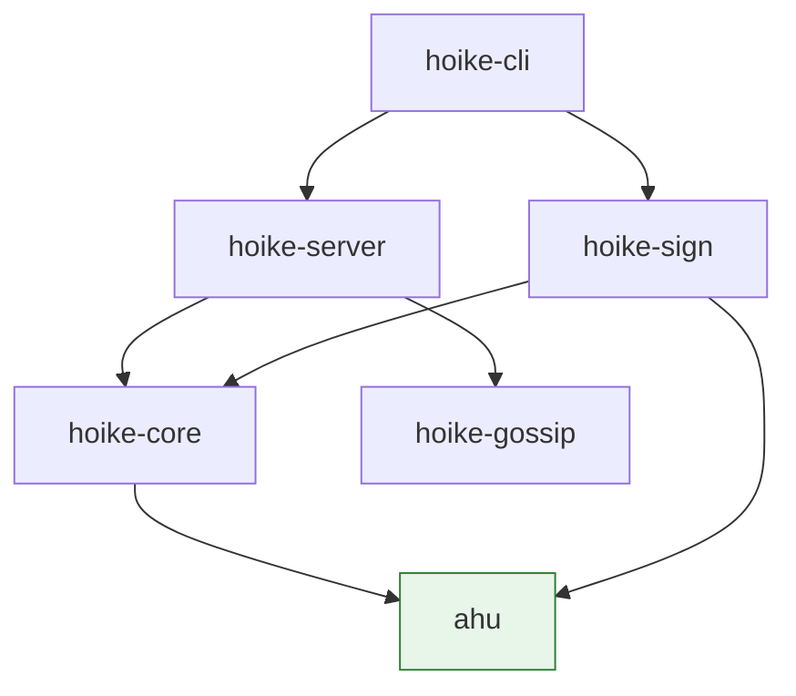

# Development Setup

This page covers everything needed to build, run, and develop hoike from
source.

## Prerequisites

| Requirement | Version | Notes |
|-------------|---------|-------|
| Rust | 1.85+ | Edition 2024. Install via [rustup](https://rustup.rs/). |
| C linker | Any | Xcode CLT (macOS), `build-essential` (Debian/Ubuntu), `gcc` (Fedora/RHEL) |
| OpenSSL | 3.x | For test certificate generation only |
| Git | 2.x | For cloning |

Verify your Rust toolchain:

```sh
rustc --version   # 1.85.0 or later
cargo --version
```

## Clone and build

```sh
git clone https://github.com/czinda/hoike.git
cd hoike
cargo build --release
```

The workspace produces two binaries:

| Binary | Location | Size |
|--------|----------|------|
| `hoike` | `target/release/hoike` | ~8 MB |
| `ahu` | `target/release/ahu` | ~1 MB |

For development builds (faster compilation, slower runtime):

```sh
cargo build
```

## Workspace structure

The Cargo workspace contains six crates:

```
hoike/
  Cargo.toml              # Workspace root
  crates/
    ahu/                   # Bundle format (Apache-2.0 OR MIT)
      Cargo.toml
      src/
      tests/
    hoike-core/            # Shared types, config, routing (GPL-3.0+)
      Cargo.toml
      src/
      tests/
    hoike-sign/            # Response production, signing (GPL-3.0+)
      Cargo.toml
      src/
      tests/
    hoike-server/          # HTTP handlers (GPL-3.0+)
      Cargo.toml
      src/
      tests/
        conformance.rs
    hoike-gossip/          # SWIM protocol (GPL-3.0+)
      Cargo.toml
      src/
    hoike-cli/             # CLI entry points (GPL-3.0+)
      Cargo.toml
      src/
        bin/
          hoike.rs
          ahu.rs
  testdata/
    generate.rs            # Test certificate/CRL generation
```

## Crate dependency graph

Dependencies flow downward. The `ahu` crate is at the bottom and has no
server-side dependencies:



The green-highlighted `ahu` crate is the trust boundary for the
dual-license split. It must never depend on tokio, hyper, axum, or
PKCS#11.

## The dual-DER-version note

The workspace uses two versions of the RustCrypto `der` crate:

| Crate | `der` version | Reason |
|-------|--------------|--------|
| `x509-ocsp` 0.2.x | `der` 0.7 | OCSP request/response parsing (tracks `x509-cert` 0.2) |
| `ahu` | `der` 0.8 | Bundle manifest and seal operations |

This is intentional. The `x509-ocsp` crate has not yet released a
version that uses `der` 0.8. Cargo handles the two versions transparently,
but be aware of this when working on code that bridges the two:

- Types from `der` 0.7 are **not** interchangeable with types from `der` 0.8
- Conversion between the two versions requires re-encoding as DER bytes
  and re-parsing
- The bridge code lives in `hoike-core` where the two versions meet

If `x509-ocsp` releases a `der` 0.8 compatible version, the workspace
should be updated to unify on a single version.

## Building individual crates

Build only the bundle library:

```sh
cargo build --release -p ahu
```

The `ahu` crate supports `--no-default-features` for minimal builds:

```sh
cargo build --release -p ahu --no-default-features
```

Build without gossip support:

```sh
cargo build --release -p hoike-cli --no-default-features
```

## Generating API documentation

```sh
cargo doc --workspace --no-deps --open
```

This builds rustdoc for all six crates and opens the result in a browser.

## Running tests

Run the full test suite:

```sh
cargo test --workspace
```

See the [Testing](./testing.md) page for detailed test categories and
options.

## Development tools

Recommended but not required:

| Tool | Purpose | Install |
|------|---------|---------|
| `cargo-watch` | Auto-rebuild on save | `cargo install cargo-watch` |
| `cargo-nextest` | Faster test runner with better output | `cargo install cargo-nextest` |
| `mdbook` | Build the documentation book | `cargo install mdbook` |
| `mdbook-mermaid` | Mermaid diagram support for mdbook | `cargo install mdbook-mermaid` |

Development workflow with `cargo-watch`:

```sh
# Rebuild on change
cargo watch -x build

# Run tests on change
cargo watch -x 'test --workspace'
```

## Environment variables

| Variable | Default | Description |
|----------|---------|-------------|
| `HOIKE_LOG` | `info` | Log level (trace, debug, info, warn, error) |
| `HOIKE_CONFIG` | None | Path to configuration file |
| `RUST_BACKTRACE` | `0` | Set to `1` for backtraces on panic |

## IDE setup

hoike uses standard Rust tooling. Any editor with `rust-analyzer` support
works well:

- **VS Code**: Install the `rust-analyzer` extension
- **Neovim**: Use `nvim-lspconfig` with `rust_analyzer`
- **IntelliJ**: Use the Rust plugin

The workspace root `Cargo.toml` is the correct entry point for
`rust-analyzer`. No additional configuration is needed.
