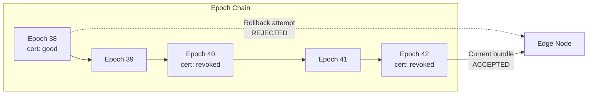

# Anti-Rollback Protection

Anti-rollback protection prevents an attacker or misconfiguration from replaying an older bundle to restore previously-revoked certificates to "good" status. This is a critical security property — without it, an adversary with access to historical bundles could silently undo revocations.

## The Threat

Consider a certificate revoked in epoch 40. If an attacker can replace the current bundle (epoch 42) with a bundle from epoch 38 (before the revocation), the edge would start serving "good" responses for the revoked certificate. Anti-rollback makes this impossible.



## Epoch Chain

Each bundle carries a monotonically increasing **epoch number**, scoped per CA. The signer increments the epoch on every bundle production — whether scheduled or triggered by an urgent revocation.

The epoch chain forms a simple sequence:

```
epoch N → epoch N+1 → epoch N+2 → ...
```

Every bundle's epoch is recorded in its CBOR manifest and covered by the CMS seal, so it cannot be altered without breaking the signature.

## High-Water Marks

The `state_db` directory persists the **highest epoch seen** for each CA. On every bundle load, the edge enforces:

```
new_epoch ≥ stored_high_water_mark
```

If the new bundle's epoch is less than the stored high-water mark, the bundle is rejected as a rollback.

### Example

| Event | Stored HWM | Incoming Epoch | Result |
|-------|-----------|----------------|--------|
| Load epoch 40 | 39 | 40 | **Accepted** — HWM updated to 40 |
| Load epoch 41 | 40 | 41 | **Accepted** — HWM updated to 41 |
| Load epoch 38 | 41 | 38 | **Rejected** — rollback detected |
| Load epoch 41 (different digest) | 41 | 41 | **Rejected** — fork detected |

## Fork Detection

If two bundles arrive with the **same epoch but different content digests**, this is a **fork** — it means two signers produced bundles independently for the same CA, or a single signer's state was cloned.

Fork detection catches:

- **Misconfigured duplicate signers**: Two signer instances both believe they are authoritative for the same CA
- **State cloning**: A signer's state directory was copied, producing a second lineage
- **Compromise**: An attacker with the signing key producing alternative bundles

Fork is always a critical security event requiring immediate investigation.

## Rejection Reasons

Bundle load failures are categorized into four reasons:

| Reason | Condition | Severity |
|--------|-----------|----------|
| **rollback** | New epoch < stored high-water mark | **Critical** — possible replay attack |
| **fork** | Same epoch, different content digest | **Critical** — duplicate signer or compromise |
| **digest** | Bundle content does not match manifest digest | **High** — corruption or tampering |
| **seal** | CMS signature verification failed | **High** — wrong key, tampering, or corruption |

The first two (`rollback` and `fork`) are security events. The latter two (`digest` and `seal`) typically indicate data corruption during transfer, though tampering should not be ruled out.

## state_db Persistence

The `state_db` directory is where epoch high-water marks live. It **must persist** across process restarts, container recreations, and node replacements.

```toml
[storage]
state_db = "/var/lib/hoike/state"
```

**If state_db is lost**, the node loses all high-water marks and becomes vulnerable to rollback attacks until it loads a current-epoch bundle. This is why `state_db` is a separate path from `bundle_dir`:

- `bundle_dir` can be ephemeral — bundles are replaceable (re-pull from signer or re-import)
- `state_db` is **persistent state** — mount it on durable storage, back it up, and include it in disaster recovery plans

In containerized environments, `state_db` should be on a persistent volume, not an ephemeral container filesystem.

## Critical Alerts

Two metrics form the foundation of hoike operational monitoring:

### `bundle_next_update_seconds`

**What:** Gauge showing seconds until the current bundle's `nextUpdate` timestamp.

**Why it matters:** When this reaches zero, the edge is serving responses past their validity window. Relying parties that check freshness will reject them.

**Alert thresholds:**

| Level | Threshold | Meaning |
|-------|-----------|---------|
| Warning | < 4h remaining | Signer may be down; investigate |
| Critical | < 1h remaining | Responses will expire soon; immediate action required |

The warning threshold should be comfortably above `batch_interval` (default 1h). With a 24h validity and 1h batch interval, alerting at 4h gives you three missed batches before going critical.

### `bundle_load_failures` (by reason)

**What:** Counter of failed bundle loads, labeled by rejection reason (`rollback`, `fork`, `digest`, `seal`).

**Why it matters:** Any non-zero increment for `rollback` or `fork` is a **critical security alert** requiring immediate investigation.

**Alert rules:**

| Reason | Alert level | Action |
|--------|-------------|--------|
| `rollback` | **Critical** | Possible replay attack. Investigate bundle distribution path immediately. |
| `fork` | **Critical** | Duplicate signer or compromise. Identify and shut down the rogue signer. |
| `digest` | Warning | Likely transfer corruption. Re-transfer the bundle. |
| `seal` | Warning | Wrong signing key or corruption. Verify signer configuration. |

## Recovery Procedures

### Rollback Detected

1. **Investigate the source.** Why was an old bundle offered? Common causes:
   - Stale bundle cached in a CDN or reverse proxy
   - Misconfigured bundle distribution pipeline pointing at an old directory
   - An attacker replaying a captured bundle
2. **Fix the distribution path.** Purge stale caches, correct directory pointers.
3. **Produce a new bundle** from the authoritative signer. The new epoch will be above the high-water mark and will load successfully.

### Fork Detected

1. **Identify the duplicate signer.** Check which hosts are running in signer mode for the affected CA.
2. **Shut down the unauthorized signer.** Only one signer should be authoritative per CA at any time.
3. **Produce a new bundle** from the authoritative signer with the next epoch.
4. **Audit the fork window.** Determine whether any responses from the forked lineage were served, and whether they differed in revocation status.

### Digest or Seal Failure

1. **Check for media corruption.** Re-download or re-transfer the bundle.
2. **Verify with `ahu verify`** on a trusted workstation to confirm the bundle is intact at the source.
3. **If the source bundle also fails verification**, investigate the signer — the signing key may have changed, or the signer may be compromised.
