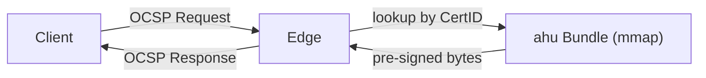
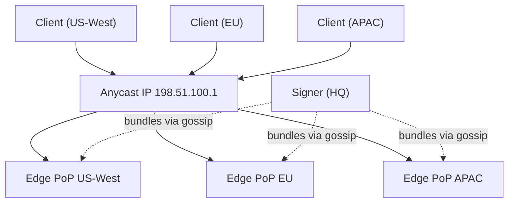

# Edge Mode

Edge nodes are the public-facing layer of a hoike deployment. They hold **no private
keys** — they load pre-signed ahu bundles into memory and serve stored OCSP response
bytes verbatim. This makes edge nodes safe to deploy in untrusted network zones,
at the perimeter, or in third-party hosting environments.

## How It Works



1. An ahu bundle is loaded into memory via `mmap`.
2. The sorted index inside the bundle enables **O(log n) binary search** by CertID.
3. On a hit, the edge returns the pre-signed response bytes — no cryptographic
   operations, no key material involved.
4. On a miss, the edge returns an `unauthorized` response per
   [RFC 6960 §2.3](https://www.rfc-editor.org/rfc/rfc6960#section-2.3). It **never**
   fabricates or signs responses.

## Configuration

Edge mode requires minimal configuration — no signing keys, no revocation sources,
no `[[ca]]` sections for batch production. Set `mode = "edge"` and point at storage:

```toml
[server]
mode   = "edge"
listen = "0.0.0.0:2560"

[storage]
bundle_dir = "/var/lib/hoike/bundles"
state_db   = "/var/lib/hoike/state"
```

| Key | Purpose |
|-----|---------|
| `bundle_dir` | Directory where ahu bundle files are stored. Edge watches this directory for new or updated bundles. |
| `state_db` | Persists epoch high-water marks for anti-rollback protection. **Must survive restarts** — do not place on ephemeral storage. |

> **Note:** The `[[ca]]` sections are still needed on an edge to define routing and
> nonce policy, but signing-related fields (`signing`, `sig_alg`, `responder_key`)
> are ignored in edge mode.

## Response Lookup

When an OCSP request arrives, the edge resolves it in two steps:

1. **issuerKeyHash multimap** — The CertID's `issuerKeyHash` field identifies which
   CA the request is for. The edge maintains a multimap from issuerKeyHash to loaded
   bundles, supporting multiple CAs and re-keyed CAs.

2. **Binary search by serial number** — Within the matched bundle, the sorted index
   is searched for the certificate's serial number. The index is designed for
   cache-friendly, branchless binary search on mmap'd memory.

If no bundle matches the issuerKeyHash, or the serial number is not in the index,
the edge returns `unauthorized`. It does not proxy to the signer, attempt to sign,
or return `tryLater` — the response is deterministic and immediate.

## Bundle Acquisition

Edge nodes need to receive ahu bundles from the signer. There are three methods,
from most automated to most manual:

### Gossip Pull

When [gossip](gossip.md) is enabled, the edge joins the SWIM membership mesh. The
signer broadcasts **generation announcements** when a new bundle is produced. Edges
that see the announcement pull the bundle from the signer or from a peer that
already has it.

```toml
[gossip]
enabled      = true
bind         = "0.0.0.0:7946"
seeds        = ["edge-a.pki.example:7946", "edge-b.pki.example:7946"]
identity_key = "/etc/hoike/gossip.key"
node_name    = "edge-01"
```

This is the recommended method for connected deployments — it provides automatic
bundle distribution, failure detection, and urgent revocation propagation.

### Scheduled Fetch

Use a cron job or systemd timer to pull bundles from a central distribution point
(an HTTP server, S3 bucket, or the signer's bundle endpoint):

```bash
# Example: fetch bundles every 30 minutes
*/30 * * * * curl -sf https://signer.pki.example/bundles/latest.ahu \
    -o /var/lib/hoike/bundles/latest.ahu
```

The edge detects new or modified files in `bundle_dir` and loads them automatically.
This method works when gossip is disabled or when bundles are distributed through
existing infrastructure (artifact repos, CI/CD pipelines).

### Manual Copy

For [air-gap deployments](air-gap.md) or initial bootstrapping, copy bundles to the
edge with `scp`, `rsync`, or removable media:

```bash
scp signer:/var/lib/hoike/bundles/enterprise-issuing-01.ahu \
    edge-01:/var/lib/hoike/bundles/
```

Verify bundles before import with `ahu verify` — see the
[air-gap guide](air-gap.md) for the full procedure.

## Cache-Control Headers

The edge sets `Cache-Control: max-age=<seconds>` on every OCSP response to allow
downstream HTTP caches (CDNs, reverse proxies, browsers) to store responses:

```
max-age = validity × max_age_fraction
```

With the defaults (`validity = 24h`, `max_age_fraction = 0.5`), this produces:

```
Cache-Control: max-age=43200
```

This 12-hour max-age ensures that cached responses are refreshed well before
`nextUpdate`, even if a bundle refresh is slightly delayed.

## Horizontal Scaling

Edge nodes are effectively stateless — the only persistent state is the epoch
high-water mark in `state_db`, and even that is append-only. This makes horizontal
scaling straightforward:

- **Add more edges.** Every edge serves the same bundles and returns byte-identical
  responses for the same CertID.
- **No coordination required.** Edges do not need to talk to each other (gossip is
  optional and used only for bundle distribution, not request routing).
- **No sticky sessions.** Any edge can serve any request. Load balancers need no
  session affinity.

### Anycast Deployment

For geographic distribution, deploy edge nodes at multiple points of presence (PoPs)
behind anycast DNS or anycast IP:



Each PoP runs one or more edge instances. The signer distributes bundles to all PoPs
via gossip, scheduled fetch, or a combination. Clients are routed to the nearest PoP
by the network layer.

## Storage Requirements

| Path | Contents | Persistence |
|------|----------|-------------|
| `bundle_dir` | ahu bundle files | Replaceable — bundles can be re-fetched from the signer. Use fast local storage for mmap performance. |
| `state_db` | Epoch high-water marks | **Must persist** across restarts and redeployments. Loss of state_db disables anti-rollback protection until the next full bundle is loaded. |

### Sizing

- **bundle_dir**: Each bundle is roughly proportional to the number of certificates
  the CA has issued. A CA with 1 million certificates produces bundles in the tens of
  megabytes. Plan for 2× headroom to hold both current and in-flight bundles during
  rotation.
- **state_db**: Small — a few kilobytes per CA. The critical requirement is
  durability, not capacity.

## Operational Monitoring

Key metrics to watch on edge nodes:

| Metric | Alert Condition | Meaning |
|--------|----------------|---------|
| `bundle_next_update_seconds` | < `batch_interval` | Bundle is about to expire — signer may be down or distribution is broken |
| `bundle_load_failures` | Any increment | Edge failed to load a bundle — check reason label (`rollback`, `fork`, `digest`, `seal`) |
| `ocsp_unauthorized_total` | Sustained spike | Clients are requesting certificates the edge doesn't know about — possible misconfiguration or missing CA bundle |
| `ocsp_request_duration_seconds` | p99 > 1ms | Lookup should be sub-millisecond; high latency suggests memory pressure or bundle corruption |

## Example: Full Edge Configuration

```toml
[server]
mode        = "edge"
listen      = "0.0.0.0:2560"
max_request = 8192

[storage]
bundle_dir = "/var/lib/hoike/bundles"
state_db   = "/var/lib/hoike/state"
max_chain  = 24

[gossip]
enabled      = true
bind         = "0.0.0.0:7946"
seeds        = ["edge-a.pki.example:7946", "edge-b.pki.example:7946"]
identity_key = "/etc/hoike/gossip.key"
node_name    = "edge-01"

[[ca]]
label         = "enterprise-issuing-01"
nonce_policy  = "ignore"
certid_compat = "dual"
```
