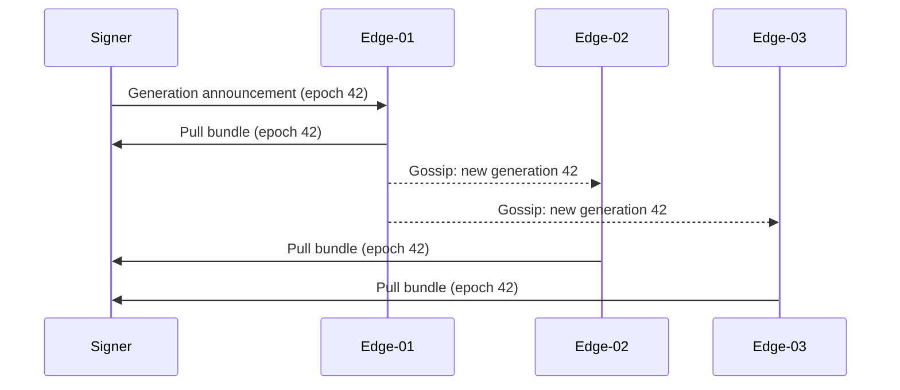

# Gossip Configuration

hoike uses the [SWIM protocol](https://www.cs.cornell.edu/projects/Quicksilver/public_pdfs/SWIM.pdf) (implemented via the `foca` crate) for lightweight, decentralized coordination across edge nodes. Gossip is a **notification channel** — it never carries OCSP response data and is never authoritative.

## What Gossip Provides

Gossip serves three purposes in a hoike deployment:

| Function | Description |
|----------|-------------|
| **Membership** | Automatic discovery and failure detection of edge nodes in the fleet |
| **Generation announcements** | Signer broadcasts when a new bundle generation is available; edges pull the bundle on receipt |
| **Urgent revocation notices** | Immediate notification when an off-cycle delta bundle is produced due to a revocation event |



## Configuration

```toml
[gossip]
enabled      = true
bind         = "0.0.0.0:7946"
seeds        = ["edge-a.pki.example:7946", "edge-b.pki.example:7946"]
identity_key = "/etc/hoike/gossip.key"
node_name    = "edge-01"
```

| Key | Type | Default | Description |
|-----|------|---------|-------------|
| `enabled` | bool | `true` | Enable or disable gossip. Set to `false` for air-gap deployments. |
| `bind` | string | `"0.0.0.0:7946"` | Address and port to bind the gossip listener. |
| `seeds` | array of strings | `[]` | Initial contact points for joining the gossip mesh. |
| `identity_key` | path | — | Path to the Ed25519 key used to sign gossip messages. |
| `node_name` | string | hostname | Human-readable, unique identifier for this node in the mesh. |

## Seed Configuration

Seeds are the initial contact points a node uses to join the gossip mesh. They are not special — any existing mesh member can serve as a seed.

**Recommendations:**

- Configure **at least two seeds** for redundancy. If the single seed is down when a new node starts, it cannot join the mesh.
- Seeds do not need to be dedicated infrastructure. Point new nodes at two or three stable, long-lived edge nodes.
- A node does not need to list every member — once it contacts one seed, SWIM propagates the full membership.

```toml
[gossip]
seeds = [
    "edge-a.pki.example:7946",
    "edge-b.pki.example:7946",
    "edge-c.pki.example:7946",
]
```

## Identity Key

Every gossip participant signs its messages with an Ed25519 key. This prevents spoofed announcements from unauthorized nodes.

Generate a key:

```bash
hoike keygen --gossip -o /etc/hoike/gossip.key
chmod 600 /etc/hoike/gossip.key
```

The key file contains the Ed25519 private key. Protect it with appropriate file permissions. The corresponding public key is derived automatically and exchanged during the SWIM join handshake.

## Node Name

`node_name` is a human-readable identifier for the node, used in logs and diagnostics. It must be **unique** across the mesh.

If omitted, hoike defaults to the system hostname. In containerized environments where hostnames may collide, set `node_name` explicitly.

## Failure Detection

SWIM detects failed nodes through a three-phase protocol:

1. **Ping**: A random member is pinged each protocol period.
2. **Ping-req**: If the ping times out, `k` other members are asked to ping the suspect on behalf of the requester (indirect probe).
3. **Suspect → Confirm**: If indirect probes also fail, the node is marked suspect. After a timeout, it is declared failed and removed from the membership list.

Failed nodes stop receiving generation announcements and urgent revocation notices. When they recover, they rejoin via their configured seeds and pull the current bundle.

## Security Model

> **Gossip is never authoritative.** It is a hint channel that triggers bundle pulls. All trust decisions are made by verifying the bundle itself.

The security boundaries are:

- **All gossip messages are signed** with the sender's `identity_key`. Unsigned or incorrectly signed messages are dropped.
- **Bundle validity is verified independently** via CMS seal and epoch chain — not via gossip trust. A gossip announcement only says "a new generation exists"; the edge independently verifies every bundle it loads.
- **A compromised gossip node cannot inject bad responses.** The worst it can do is trigger unnecessary pull attempts. The pulled bundle must still pass CMS seal verification and anti-rollback checks.
- **Gossip cannot suppress bundles.** Edges also poll on a schedule, so even if gossip is disrupted, bundles are eventually loaded.

## Network Requirements

Gossip uses **UDP** on the configured `bind` port (default 7946).

Firewall rules must allow:

- **Inbound UDP** on the gossip port from all mesh members
- **Outbound UDP** to all mesh members on their gossip port

In environments with strict firewall policies, you may need to allowlist the gossip port between all edge nodes and the signer. If UDP is blocked entirely, disable gossip and use [air-gap mode](./air-gap.md) or scheduled bundle fetching.

## Disabling Gossip

For air-gap deployments or environments where gossip is not feasible:

```toml
[gossip]
enabled = false
```

See [Air-Gap Deployments](./air-gap.md) for the full air-gap configuration guide.
