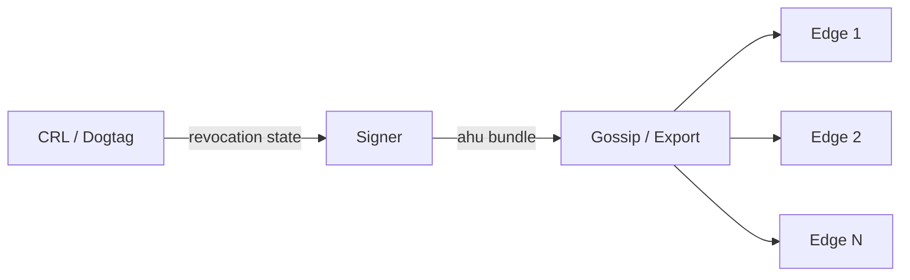

# Signer Mode

The signer is the security-critical half of hoike's split architecture. It holds private signing keys, reads revocation state from configured sources, and batch-produces **ahu bundles** — self-describing containers of pre-signed OCSP responses that edge nodes serve verbatim.



## Enabling Signer Mode

Set `mode = "signer"` in the `[server]` section:

```toml
[server]
mode   = "signer"
listen = "0.0.0.0:2560"
```

In signer mode, hoike does **not** serve OCSP responses to clients directly. Its job is to produce ahu bundles and distribute them to edge nodes (via gossip, manual copy, or scheduled fetch).

## Revocation Sources

Each `[[ca]]` section declares a revocation source that the signer polls for certificate status.

### CRL (implemented)

The CRL adapter reads a DER- or PEM-encoded CRL from a local path:

```toml
[[ca]]
label  = "enterprise-issuing-01"
source = { type = "crl", path = "/var/lib/hoike/crls/enterprise.crl" }
```

The signer re-reads the CRL file on every batch cycle. An external process (e.g., `cron` + `curl`) is responsible for keeping the CRL file up to date.

### Dogtag 389 DS syncrepl (requires `--features dogtag-sync`)

RFC 4533 Content Synchronization against the Dogtag 389 DS certificate repository. This is the **positive issuance source** — it enumerates every issued certificate, enabling `authoritative-complete` bundles where a miss is confirmed "never issued."

```toml
[[ca]]
label  = "dogtag-ca-01"
completeness = "authoritative-complete"

[ca.source]
type             = "dogtag-sync"
ldap_url         = "ldap://ds-iot.cert-lab.local:3389"
base_dn          = "ou=certificateRepository,ou=ca,o=pki-iot-ca-CA"
bind_dn          = "cn=Directory Manager"
bind_password_env = "HOIKE_LDAP_PASSWORD"
```

The adapter performs an initial full refresh, then uses the sync cookie for incremental updates. Certificate statuses are mapped: `VALID`→Good, `REVOKED`→Revoked (with reason/time), `REVOKED_EXPIRED`→Revoked, `EXPIRED`/`INVALID`→skipped.

## Batch Production

The signer produces ahu bundles on a recurring schedule controlled by three parameters:

| Parameter        | Default | Description                                                        |
|------------------|---------|--------------------------------------------------------------------|
| `batch_interval` | `1h`    | How often the signer produces a new bundle                         |
| `validity`       | `24h`   | Response validity window (`nextUpdate` − `thisUpdate`)             |
| `jitter`         | `2h`    | Random offset added to `thisUpdate` to prevent thundering-herd     |

```toml
[[ca]]
label          = "enterprise-issuing-01"
source         = { type = "crl", path = "/var/lib/hoike/crls/enterprise.crl" }
batch_interval = "1h"
validity       = "24h"
jitter         = "2h"
```

### Signer Outage Budget

The **outage budget** is the maximum time the signer can be offline before edge nodes begin serving expired responses:

```
outage_budget = validity − batch_interval
```

With defaults: **24h − 1h = 23 hours**. This is the single most important number for capacity planning. If the signer goes down, edge nodes continue serving the last bundle until `nextUpdate` passes.

To increase the outage budget, increase `validity` — but longer validity means revocation information takes longer to propagate. This is a fundamental trade-off.

### Jitter

The `jitter` parameter adds a random offset (up to the configured duration) to `thisUpdate` in each response. This prevents all responses in a bundle from expiring at exactly the same instant, which would cause a cache stampede at relying parties.

## Signing Configuration

### Signing Keys

hoike supports three key sources. The `[ca.signing_key]` table is required for signer/combined mode.

**PKCS#8 file:**
```toml
[ca.signing_key]
type = "file"
path = "/etc/hoike/ocsp-signing.key"
```

**PKCS#11 HSM** (requires `--features pkcs11`):
```toml
[ca.signing_key]
type        = "pkcs11"
module      = "/usr/lib/libCryptoki2_64.so"    # Thales Luna
token_label = "hoike-partition"
key_label   = "ocsp-signing"
pin_env     = "HOIKE_HSM_PIN"
```

Omit `pin` and `pin_env` to prompt interactively at startup (recommended for production). Documented HSM module paths: Thales Luna, Entrust nShield, Utimaco CryptoServer, FutureX Vectera, Kryoptic (testing).

**Demo key** (testing only — produces a warning):
```toml
[ca.signing_key]
type = "demo"
```

### Delegated Signing

When a delegated OCSP signing certificate is configured, it is embedded in every `BasicOCSPResponse.certs` per RFC 9919 §3.2.2. The `ResponderID` is computed from the certificate's SPKI key hash (not the CA's key).

```toml
[[ca]]
label          = "enterprise-issuing-01"
responder_cert = "/etc/hoike/ocsp-responder.pem"
```

The responder certificate must have `id-kp-OCSPSigning` EKU and be issued by the CA.

### Signature Algorithms

| Algorithm    | Type           | Notes                              |
|--------------|----------------|------------------------------------|
| `ecdsa-p256` | Classical      | Default; widely supported          |
| `ml-dsa-44`  | Post-quantum   | NIST FIPS 204, security level 2    |
| `ml-dsa-65`  | Post-quantum   | NIST FIPS 204, security level 3    |
| `ml-dsa-87`  | Post-quantum   | NIST FIPS 204, security level 5    |

```toml
[[ca]]
label   = "pqc-ready-ca"
sig_alg = "ml-dsa-65"
```

> **Note:** Post-quantum algorithms produce significantly larger signatures. Verify that your relying parties support ML-DSA before switching.

### Responder ID

The `responder_id` field controls how the responder identifies itself in OCSP responses:

```toml
responder_id = "by-key"    # SubjectPublicKeyInfo hash (default, recommended)
```

### CertID Compatibility

The `certid_compat` field controls which hash algorithms the signer uses for CertID matching:

| Value    | Behavior                                                          |
|----------|-------------------------------------------------------------------|
| `dual`   | Index by both SHA-256 and SHA-1 hashes (default, widest compat)   |
| `sha256` | SHA-256 only (RFC 9654 compliant, modern clients)                 |
| `sha1`   | SHA-1 only (legacy clients only — not recommended)                |

```toml
certid_compat = "dual"
```

## PKCS#11 / HSM Support

> **Status:** Planned, not yet implemented.

PKCS#11 integration will allow the signer to use hardware security modules (HSMs) for key storage and signing operations. When available, the signing key path will be replaced with a PKCS#11 URI:

```toml
# Future syntax (not yet supported)
responder_key = "pkcs11:token=hoike;object=ocsp-signer;type=private"
```

Until then, the signer reads key material from PEM files on disk. Protect these files with filesystem permissions and, where possible, full-disk encryption.

## Urgent Revocation

When `urgent_revocation = true` (the default), the signer produces an **off-cycle delta bundle** immediately upon detecting a newly revoked certificate — without waiting for the next scheduled `batch_interval`.

```toml
[[ca]]
urgent_revocation = true   # default
```

This is critical for high-security deployments where the standard batch interval creates an unacceptable revocation propagation delay. The delta bundle is distributed to edges through the normal gossip or pull mechanism.

Set `urgent_revocation = false` only if your revocation SLA is satisfied by the regular batch interval.

## Completeness

The `completeness` field declares the signer's knowledge of the CA's revocation state:

| Value                      | Meaning                                                       |
|----------------------------|---------------------------------------------------------------|
| `authoritative-complete`   | Signer has full revocation knowledge (direct CA access)       |
| `partial`                  | CRL-only; may miss certificates not yet on the CRL            |

```toml
completeness = "authoritative-complete"
```

When set to `authoritative-complete`, the signer produces `good` responses for any serial number not found in the revocation source. When set to `partial`, unknown serials receive an `unknown` status, since the signer cannot confirm they are unrevoked.

## Full Signer Example

```toml
[server]
mode   = "signer"
listen = "127.0.0.1:2560"

[storage]
bundle_dir = "/var/lib/hoike/bundles"
state_db   = "/var/lib/hoike/state"

[gossip]
enabled      = true
bind         = "0.0.0.0:7946"
identity_key = "/etc/hoike/gossip.key"
node_name    = "signer-01"

[[ca]]
label          = "enterprise-issuing-01"
source         = { type = "crl", path = "/var/lib/hoike/crls/enterprise.crl" }
signing        = "delegated"
responder_cert = "/etc/hoike/ocsp-responder.pem"
responder_key  = "/etc/hoike/ocsp-responder.key"
sig_alg        = "ecdsa-p256"
responder_id   = "by-key"
certid_compat  = "dual"
nonce_policy   = "ignore"
validity       = "24h"
batch_interval = "1h"
jitter         = "2h"
completeness   = "authoritative-complete"
urgent_revocation = true
```

## Operational Considerations

- **Key protection:** The signer is the only component that touches private keys. Run it on a hardened host with restricted network access. In high-security deployments, consider an air-gapped signer that exports bundles to removable media (see [Air-Gap Deployments](./air-gap.md)).

- **Monitoring:** Watch `bundle_production_seconds` (histogram) and `bundle_next_update_seconds` (gauge) metrics. Alert when `bundle_next_update_seconds` drops below your outage budget threshold.

- **Backup:** The `state_db` directory contains epoch high-water marks used for [anti-rollback protection](./anti-rollback.md). Back it up — but never restore an old snapshot, as this could allow rollback attacks.

- **Scaling:** The signer does not need horizontal scaling — bundle production is inherently serial per CA. For multiple CAs, configure multiple `[[ca]]` sections in a single signer (see [Multi-CA Routing](./multi-ca.md)).
