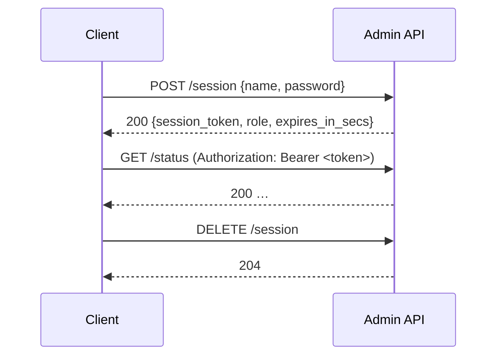

# Admin API and RBAC

The admin API is a JSON REST surface mounted at `/api/admin` on the admin listener (`server.admin_listen`) or, when no admin listener is configured, on the OCSP listener. The web UI at `/ui/` is a client of this API and has no capabilities beyond it. See [TLS and Mutual TLS](../operator/tls.md) for putting the listener behind TLS; do not expose it in cleartext.

## Operators and roles

Operators are defined statically in configuration. There are no built-in accounts and no self-registration.

```toml
[server.admin]
session_ttl_secs = 3600

[[server.admin.operators]]
name          = "alice"
password_hash = "$2b$12$…"      # bcrypt cost 12; see "Generating a password hash"
role          = "administrator"

[[server.admin.operators]]
name          = "noc"
password_hash = "$2b$12$…"
role          = "viewer"          # default when omitted
```

| Role | Can | Cannot |
|------|-----|--------|
| `viewer` | Read status, bundles, certificates, rotation state, gossip membership, effective config, anti-rollback state; run OCSP queries; extract a single entry from a bundle | Change anything |
| `operator` | Everything a viewer can, plus reload bundles, inspect/verify/diff bundles, apply deltas, trigger on-demand signing | Rotate keys |
| `administrator` | Everything | — |

Roles are strictly ordered (`viewer` < `operator` < `administrator`); a route's minimum role is checked on every request.

### Generating a password hash

hoike does not yet ship a hashing subcommand. Any bcrypt tool works; cost 12 is the value the server's timing decoy assumes:

```sh
# Apache htpasswd (httpd-tools)
htpasswd -nbBC 12 "" 'correct horse battery staple' | tr -d ':\n'

# Python
python3 -c 'import bcrypt,getpass; print(bcrypt.hashpw(getpass.getpass().encode(), bcrypt.gensalt(12)).decode())'
```

Never commit a hash from the documentation examples; the server should be treated as compromised if a documented hash is found in a live configuration.

## Session lifecycle



- Tokens are 32 random bytes, hex-encoded, presented as `Authorization: Bearer <token>`.
- A session lives for `session_ttl_secs` (default 3600) from login. There is no idle timeout; the lifetime is fixed.
- Logout (`DELETE /session`) invalidates the token immediately. Restarting the process invalidates all sessions; the session store is in memory only.
- The web UI stores the token in browser `sessionStorage`, which is cleared when the tab closes.

### Login limits

Login is deliberately expensive and bounded:

| Bound | Value |
|-------|-------|
| Request body | 4,096 bytes, 5-second read timeout |
| Concurrent password verifications | 4 |
| Process-wide login attempts | 60 per minute (`429 Too Many Requests` beyond that) |
| Active sessions | 4,096 (login fails with `503` when full; expired sessions are pruned first) |
| Unknown operator | Verified against a decoy hash so timing does not reveal whether the name exists |

There is **no per-account lockout** and **no password-complexity enforcement** in this release. Both are planned; see [DISA STIG Guidance](../compliance/stig.md). Until then, put the admin listener behind mutual TLS and a management network.

## Endpoints

All paths are relative to `/api/admin`. All require a bearer token except `POST /session`.

### Session

| Method | Path | Role | Description |
|--------|------|------|-------------|
| `POST` | `/session` | — | Log in; body `{"name": "...", "password": "..."}` |
| `DELETE` | `/session` | any | Log out |

### Read-only

| Method | Path | Role | Description |
|--------|------|------|-------------|
| `GET` | `/status` | viewer | Process mode, uptime, loaded CAs, generation, freshness |
| `GET` | `/bundles` | viewer | Loaded bundles per CA with epoch, entry counts, algorithm |
| `GET` | `/bundles/{label}` | viewer | Detail for one CA's bundle |
| `GET` | `/certs` | viewer | Responder and seal certificates with expiry |
| `GET` | `/rotation` | viewer | Key-rotation monitor state per CA |
| `GET` | `/gossip` | viewer | SWIM membership and last generation announcements |
| `GET` | `/config` | viewer | Effective configuration with secrets redacted |
| `GET` | `/state` | viewer | Anti-rollback high-water marks |
| `POST` | `/query` | viewer | Run an OCSP query against the local responder; body carries serial and issuer hashes |
| `POST` | `/bundles/extract` | viewer | Return one entry from a bundle by CertID |

### Bundle operations

| Method | Path | Role | Description |
|--------|------|------|-------------|
| `POST` | `/bundles/reload` | operator | Re-read `bundle_dir`, applying seal trust and anti-rollback checks |
| `POST` | `/bundles/inspect` | operator | Parse a bundle and return its manifest |
| `POST` | `/bundles/verify` | operator | Verify a bundle's seal against the configured trust policy |
| `POST` | `/bundles/diff` | operator | Compare two generations |
| `POST` | `/bundles/apply` | operator | Materialize deltas; output is **unsigned** unless a seal key is available on this node |

### Signing and rotation (signer or combined mode only)

| Method | Path | Role | Description |
|--------|------|------|-------------|
| `POST` | `/sign/{label}` | operator | Produce a new generation for one CA now |
| `POST` | `/sign/all` | operator | Produce new generations for every CA |
| `POST` | `/rotate/{label}` | administrator | Run the configured `rotation_command` and reload key material for one CA |

Signing routes share the signer mutex with scheduled production, so an on-demand run never interleaves with a scheduled one.

## Errors

Errors are returned as short JSON strings with conventional status codes: `401` missing or expired token, `403` insufficient role, `409` signer busy, `422` malformed input, `429` login rate exceeded, `503` feature not built or capacity exhausted. Error bodies never include stack traces, file paths, or key material.

## Audit trail

Bundle loads, signing runs, and rotation attempts emit [audit events](audit-logging.md). Login success and failure are not yet audited and events do not yet carry the operator name; both are tracked for the next release.
